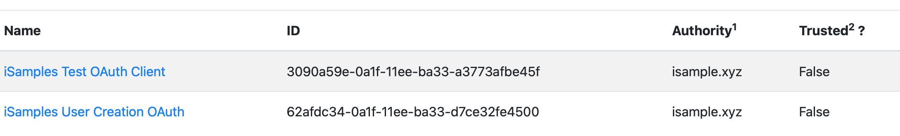

# iSamples Hypothesis Integration/Dev Guide

iSamples has integrated with Hypothesis to allow for content annotation.  Eventually, we expect all of the server-side hosting to be done by hypothesis, but at this moment, it works against a locally hosted h server instance.

## Overall iSamples Changes
* Change iSamples Web UI to [configure the hypothesis client] (https://github.com/isamplesorg/isamples_webui/tree/hypothesis_annotation_lib) -- [Hypothesis client config docs](https://h.readthedocs.io/projects/client/en/latest/publishers/config.html?highlight=window.hypothesisConfig)
* Change iSamples in a Box to [sign JWT tokens suitable for passing to H server](https://github.com/isamplesorg/isamples_inabox/tree/hypothesis_tokens) -- [Hypothesis token docs](https://h.readthedocs.io/en/latest/publishers/authorization-grant-tokens/)
* Change iSamples in a Box to [include metadata that identifies the object being annotated](https://github.com/isamplesorg/isamples_inabox/pull/276) -- [Hypothesis metadata docs](https://web.hypothes.is/help/how-hypothesis-interacts-with-document-metadata/#dublin-core-metadata) 

## Setting up the h server

The first step is to get h running locally.  The  [instructions](https://h.readthedocs.io/en/latest/developing/install/) on the hypothesis site explain how to do so.  Note that since we aren't part of the hypothesis dev team, we definitely skip the `make devdata` step.

Once you're done, you can hit [http://localhost:5000](http://localhost:5000) to verify things are working.

### Create an admin account
Next, you'll want to [create an admin user](https://h.readthedocs.io/en/latest/developing/administration/) per the hypothesis docs.

### Create two sets of OAuth keys
Create two sets of oauth keys for account creation and token generation [use the admin interface to do so](http://localhost:5000/admin/oauthclients).

When you're done it should look something like this:

Make sure that the oauth client has the `jwt_bearer` grant type.  Make sure that the user creation oauth client has the `client_credentials` grant type.  Also make sure that both sets of keys have the same authority, and that this authority matches what you've specified in the `iSamples_webUI` javascript.

You're going to want to copy the key values and make sure they match up in the various bits of code that do the JWT signing and user creation.

### Manually create user account
At this point in time, any Hypothesis user accounts on the instance need to be manually created [with this script](https://github.com/isamplesorg/isamples_inabox/compare/develop...hypothesis_tokens#diff-1ccb2536c45675fe7b1ef1ce753d6e4f66b7e9e1782fb9773a440b30e681597c).  Make sure that all the client ids, keys, and authority match up with the keys you just created in the previous step.  Note that in the future, we expect this to be part of whatever flow assigns an orcid to an iSamples instance.  The account username should be the orcid with all `-` characters removed.

### Create an organization
[Create an organization](http://localhost:5000/admin/organizations) in the admin UI.  Make sure that the authority matches the authority of the OAuth keys you just created.

### Create a group
[Create a group](http://localhost:5000/admin/groups/new) in the admin UI.  Make sure it uses the organization you created in the previous step.

### Assign the account to the group
After you've created the group, you can add the user to the group in the admin UI.  The user account needs to be assigned to the authority that match the organization associated with the group.  Long-term, this will be integrated into the account creation flow using [the hypothesis API](https://h.readthedocs.io/en/latest/api-reference/#tag/groups/paths/~1groups~1%7Bid%7D~1members~1%7Buser%7D/post) for adding users to groups.

## Make an annotation!
Congrats, you can make an annotation now (provided all the authorities and keys match up):

If for some reason this isn't working, look in the web developer console.  400 errors mean that the account token being vended refers to an account that Hypothesis doesn't know about.